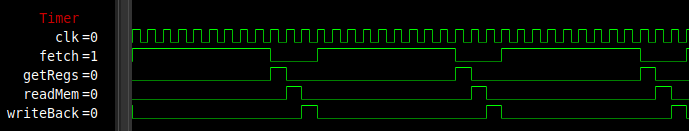

# CPU (B322)
The B322 (B4rt 32 bit processor v2) executes instructions from memory with the program counter as address. It is a 32 bit RISC CPU implementing the self designed B322 instruction set.

## B322 ISA
The B322 instruction set architecture is a RISC architecture.
Each instruction is 32 bits and can be one of the following instructions:
``` text
         |31|30|29|28|27|26|25|24|23|22|21|20|19|18|17|16|15|14|13|12|11|10|09|08|07|06|05|04|03|02|01|00|
----------------------------------------------------------------------------------------------------------
1 HALT     1  1  1  1| 1  1  1  1  1  1  1  1  1  1  1  1  1  1  1  1  1  1  1  1  1  1  1  1  1  1  1  1
2 READ     1  1  1  0||----------------16 BIT CONSTANT---------------||--A REG---| x  x |N||I||--D REG---|
3 WRITE    1  1  0  1||----------------16 BIT CONSTANT---------------||--A REG---||--B REG---| x  x  x |N|
4 COPY     1  1  0  0||----------------16 BIT CONSTANT---------------||--A REG---||--B REG---| x  x  x |N|
5 PUSH     1  0  1  1| x  x  x  x  x  x  x  x  x  x  x  x  x  x  x  x  x  x  x  x |--B REG---| x  x  x  x
6 POP      1  0  1  0| 0  0  0  x  x  x  x  x  x  x  x  x  x  x  x  x  x  x  x  x  x  x  x  x |--D REG---|
7 JUMP     1  0  0  1||--------------------------------27 BIT CONSTANT--------------------------------||O|
8 JUMPR    1  0  0  0||----------------16 BIT CONSTANT---------------| x  x  x  x |--B REG---| x  x  x |O|
9 LOAD     0  1  1  1||----------------16 BIT CONSTANT---------------| x  x  x |H| x  x  x  x |--D REG---|
10 BEQ     0  1  1  0||----------------16 BIT CONSTANT---------------||--A REG---||--B REG---| x  x  x  x
11 BNE     0  1  0  1||----------------16 BIT CONSTANT---------------||--A REG---||--B REG---| x  x  x  x
12 BGT     0  1  0  0||----------------16 BIT CONSTANT---------------||--A REG---||--B REG---| x  x  x  x
13 BGE     0  0  1  1||----------------16 BIT CONSTANT---------------||--A REG---||--B REG---| x  x  x  x
14 SAVPC   0  0  1  0| 0  0  0  x  x  x  x  x  x  x  x  x  x  x  x  x  x  x  x  x  x  x  x  x |--D REG---|
15 RETI    0  0  0  1| x  x  x  x  x  x  x  x  x  x  x  x  x  x  x  x  x  x  x  x  x  x  x  x  x  x  x  x
16 ARITH   0  0  0  0||C||--OPCODE--||--------11 BIT CONSTANT--------||--A REG---||--B REG---||--D REG---|
```

1.  `HALT`:   Will prevent the CPU to go to the next instruction by jumping to the same address. Can be interrupted.
2.  `READ`:   If !I, read from memory at address in AREG + 16 bit offset. If N == 1, then do - offset instead. If I, read interrupt ID. In both cases of I: store value in DREG.
3.  `WRITE`:  Write value from BREG to memory at address stored in AREG + 16 bit offset. If N == 1, then do - offset instead.
4.  `COPY`:   Read memory from address in AREG + 16 bit offset, then write result to memory at address in BREG + 16 bit offset. If N == 1, then do - offset instead.
7.  `PUSH`:   Pushes value in AREG to stack.
8.  `POP`:    Pops value from stack into DREG.
9.  `JUMP`:   Set PC to 27 bit constant if O is 0. If O is 1, then add the 27 bit constant to PC. 
9.  `JUMR`:   Set PC to DREG + 16 bit constant if O is 0. If O is 1, then add the value from DREG + 16 bit constant to PC. 
5.  `LOAD`:   Write 16 bit constant to DREG. If H is 0, then write data to lowest 16 bits and set highest 16 bits to 0. If H is 1, then write data to highest 16 bits and ignore lowest 16 bits.
11. `BEQ`:    If AREG == BREG, add 16 bit constant to PC.
12. `BNE`:    If AREG != BREG, add 16 bit constant to PC.
13. `BGT`:    If AREG >  BREG, add 16 bit constant to PC.
14. `BGE`:    If AREG >= BREG, add 16 bit constant to PC.
15. `SAVPC`:  Save current PC to DREG.
16. `RETI`:   Restore PC after interrupt and re-enable interrupts.
10. `ARITH`:  Execute operation specified by OPCODE on AREG and BREG. Write result to DREG. Use 11-bit constant in stead of BREG if C is 1.

## Components
The CPU consists out of the following components:

### Timer
Handles the timing of the CPU phases.

The Timer creates four phases for the CPU to execute each instruction:

1. fetch: Get instruction from memory
2. getRegs: Get register values from register bank
3. readMem: Read memory from address
4. writeBack: Write result back to register bank or memory and change the program counter

The fetch, readMem and writeBack phase can take multiple clock cycles because of the memory timings.

<figure>
    
    <figcaption>Timer waveform. Running instructions from SDRAM.</figcaption>
</figure>

### Instruction Decoder
Splits the 32 bits of each instructions using combinational logic.
These parts are then connected to various other components of the CPU. 

### Register bank
Contains 16 registers which are all 32 bit wide. Aside from `R0` which is always zero, all registers are basically GP register. However, to maintain some kind of coding consistency, some registers have a special function assigned (though their hardware implementation are the same).

The 16 32 bit registers have the current functions:
``` text
Register|Hardware 	|Assembly	|C
-----------------------------------------------------
R0 		|Always 0	|Always 0	|Always 0
R1 		|GP			|Arg|retval |GP (1st arg|retval)
R2 		|GP			|Arg|retval |GP (2nd arg)
R3 		|GP			|Arg|retval |GP (3rd arg)
R4 		|GP			|GP			|GP
R5 		|GP			|GP			|GP
R6 		|GP			|GP			|GP
R7 		|GP			|GP			|Temp
R8 		|GP			|GP			|GP
R9 		|GP			|GP			|GP
R10		|GP			|GP			|GP
R11		|GP			|GP			|GP
R12		|GP			|GP			|Temp
R13		|GP			|GP			|Temp
R14		|GP			|GP			|RBP (base pointer)
R15		|GP			|Ret Ptr 	|RSP (stack pointer)
```
The register bank has two read ports and one write port. Internally on the FPGA, the registers are implemented as two block RAM modules to increase performance and save space. One module contains the highest 16 bits, the other the lowest 16 bits. This made it easy to implement the `LOADHI` instruction.

Note that the program counter is not part of the register bank, as it is a seperate part of the CPU.

### Stack
Stack memory with internal stack pointer. The stack is mostly used in assembly coding for jumping to functions and backing up or restoring registers in interrupt handlers or functions. In combination with the SavPC instruction, one can easily jump to (and return from) functions in assembly (C uses a software stack).

The pointer wraps around in case of a push when the stack is full or in case of a pop when the stack is empty.
The stack is 1024 words deep. The stack pointer and stack memory are not accessible by the rest of the CPU. This and the small size make the stack mostly unusable for the C compiler. For this, a software stack implementation using the 32MiB SDRAM main memory and a GP register is used. However, the hardware stack is used to quickly backup and restore all 15 GP registers during an interrupt.

### ALU
Can execute 16 different operations on two 32 bit inputs. Has two flags, which are used for branch instructions. It also has an input flag `skip`. When set, the output of the ALU will just be input B. This is useful for writing values to a register after a `READ`.
The 4 bit opcode can specify the following operations:
``` text
Operation|Opcode|Description
-------------------------
OR        0000   A OR   B
AND       0001   A AND  B
XOR       0010   A XOR  B
ADD       0011   A  +   B
SUB       0100   A  -   B
SHIFTL    0101   A  <<  B
SHIFTR    0110   A  >>  B
NOTA      0111   ~A
MULT      1000   A  *   B
```

The remaining seven Opcodes are reserved for future (maybe signed?) operations.

Internally, the CPU uses flags for executing the branch instructions. These are not readable by other instructions, because they are not saved in a register:
``` text
Flags
---------
BGA: B is greater than A
BEA: B is equal to A
```

### PC
Handles all program counter related functions like jumps and interrupts.

Every writeBack cycle, the PC is increased by one. In case of a jump, the PC is set to or increased by the jump address, based on the `O` flag of the jump instruction.

The CPU has 8 interrupt pins, of which 4 standard interrupts and 4 extended interrupts (extended has nothing to do with the duration of the interrupt, see it as a pin extension). When a rising edge on one of these pins is detected and interrupts are enabled, interrupts will be disabled, the PC value of the next instruction (this includes the destination address during a jump) will be stored and the set to the value of the interrupt pin (1, 2, 3, or 4, and 2 in case of an extended interrupt). When a RETI instruction is issued, the PC will be restored and interrupts re-enabled. Interrupts are only registered on the rising edge, to prevent the same interrupt from repeating itself when the handler is already done, but the signal is still high. In case of multiple interrupts at the same time, the lowest pin number has the highest priority. Interrupt 1 to 4 have priority over the extended interrupts. A flag for each rising interrupt is stored, even when interrupts are disabled. This causes the interrupt to be delayed until interrupts are enabled again. This way less interrupts are skipped.

For the extended interrupts, the PC will still jump to address 2, but will also set an ID. This way the interrupt handler can check which interrupt was triggered. The ID can be read using the `I` (interrupt) flag in the READ instruction.

### CU
The CU, or control unit, directs all signals to the corresponding components based on the instruction, state and flags. This is done using combinational logic.