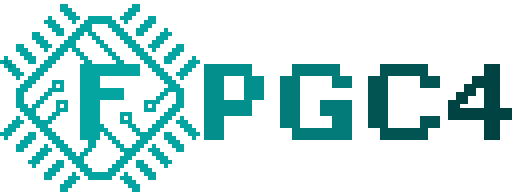

# Welcome to the FPGC Wiki!

[](https://www.github.com/b4rt-dev/fpgc5)


!!! danger
    A lot of the documentation is probably outdated

For more details, use the navigation menu.

## What it is
The FPGC5 (Field Programmable Game Console/Computer v5) is my big hobby project, built around a completely self designed SoC (System on a Chip) with my own CPU, GPU and Memory Unit, all implemented on an FPGA. The goal of this project is to understand how computers actually work, by making one myself. This is achieved by starting from scratch and adding a layer of complexity iteratively. As of writing it has a simple OS and C compiler.

Originally, the goal of this project, which started in 2017 when I bought my first FPGA, was to design a simple game console for an FPGA (hence the name FPGC). Eventually this idea shifted more towards creating an entire computer with the capabilities of a game console. Now this is shifting even more to a computer rather than game console (the third PCB doesn't even have a game controller connector anymore).

To give a general idea: The FPGC is kind of a Raspberry Pi, but with the performance of a Commodore 64, the graphics of a NES, and some "less retro" features like HDMI, USB host, Ethernet, 32MiB SDRAM and a 32 bit architecture.

The main components of the FPGC5 consist of my 32 bit CPU (B322), my tile/sprite based GPU (FSX3) and my Memory Unit (MU) that handles many different types of memory and I/O. No audio engine yet, though I do have an I2S DAC on the PCB.

Aside from the FPGA hardware, this project also contains other software projects built for the FPGC, like an assembler, C compiler (both cross-compile from Linux and self compile from BDOS), Operating System (BDOS), software libraries, programmer, example code like a webserver and a wget implementation, and more.

For this project I also designed an I/O board PCB.

## What it can do
Basically, the FPGC5 can run code, compute things, play games, output video (over NTSC or HDMI), and can interact with certain peripherals using for example GPIO, SPI or UART. It also has two USB host port for mass storage (required for BDOS) and something else, a PS/2 port for a keyboard (although an USB keyboard can also be used) and an Ethernet port for networking. It has 32MiB SDRAM and the program code is very quickly loaded from SPI flash or USB UART into SDRAM on boot. The board is powered from a single micro USB port, with UART capabilities for in-system programming.

As for performance, you should think of a computer from the 80's, but with 32MiB SDRAM, multiple gigabytes of (slow, you want to use buffers) mass storage using USB, and a (not so efficient) 32 bit CPU running at 50MHz. The GPU creates a 320x200 video output which is currently sent over a 640x480 HDMI signal and a composite NTSC signal for my CRT TV (output can be selected using a switch). The graphics are comparable to a NES (currently sprites need to be reimplemented for the HDMI/Composite output).

## Project hardware and software
The target FPGA is an Altera Cyclone IV EP4CE15 (the EP4CE6 has too little I/O, memory and logic gates). The development board used in this project is the [Cyclone IV EP4CE15 Core Board with 32MiB SDRAM from QMtech](https://www.aliexpress.com/i/32949281189.html). This board is plugged into my I/O board PCB, which provides all I/O and power.

All hardware designs are written in Verilog. Iverilog and GTKwave are used to simulate these hardware designs before writing the design to the FPGA using Quartus Prime (Lite).

Most scripts are written in Python 3 (or bash for some simple tasks), except for the C compiler, which is written in C. The cross-assembler is written in Python, and an assembler written in C is being made to run on BDOS. The assembler assembles a self designed assembly language, and the C compiler compiles C to this assembly language.

Sublime Text 3 is used as text editor/IDE, with some handy build scripts to speed up the development and to quickly send code to the FPGC.

There are also scripts that allow sending files and programs directly to BDOS over the network.

## Structure of project files
The general structure of this project:
``` text
FPGC5
├── Assembler           // Assembler (in Python) and assembly code files
├── BCC                 // C compiler project, also contains programs and OS
├── DeprCcompiler       // Old C compiler project (in Python)
├── Documentation       // Documentation website project
├── Graphics            // Scripts for graphics related stuff
├── MidiConverter       // Scripts to convert .mid files into audio asm code
├── PCB                 // PCB KiCad source files
├── Programmer          // Scripts for programming the FPGC5
├── Quartus             // Quartus project files
├── SublimeText3        // Project build scripts for Sublime Text 3
└── Verilog             // Verilog source files
    ├── memory          // Memory init related files
    ├── modules         // Hardware modules
    ├── output          // Simulation output
    └── testbench       // Simulation testbench
```

## Project Links
- [Github Repository](https://www.github.com/b4rt-dev/FPGC5)
- [Gogs Mirror](https://www.b4rt.nl/git/bart/FPGC5-mirror)
- [Documentation (this site)](https://www.b4rt.nl/fpgc)