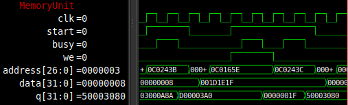

# MU

The MU, or memory unit, handles all memory access between the CPU and all the different memories used in the FPGC5. The MU makes use of a memory map (see the Memory map page) so it knows from or to which memory it should read or write. The MU contains logic for reading and/or writing each type of memory that is connected to the MU. The goal of the MU is to have the CPU access all memories without the having to care about the type or timing of the memory, making an easy memory interface for the CPU. This is achieved using a start signal from the CPU to the MU to indicate the start of a memory read or write, and a busy signal from the MU to the CPU which only goes high when the start signal is received, and goes low when the data is read or written. However, there is one cycle of overhead per operation on the MU. This means that for eample writing to VRAM (SRAM) takes two cycles instead of one.

<figure>
    
    <figcaption>MU waveform. Fetching instructions from ROM, writing to VRAM.</figcaption>
</figure>

The MU is connected to the following memories:

## SPI flash
The SPI flash is mostly used to contain a program (or second bootloader), since this allows the FPGC5 to run a program on its own without the need to have it sent over using UART. The size of the flash currently in use is 16MiB, and can be read completely by the MU. The MU makes use of an SPI flash controller which accesses the flash chip in quad SPI mode with continuous reading for faster reads. The maximum speed without modifying the amount of dummy clocks for each read is 25MHz, which is currently the speed of most of the FPGC5, which is very convenient. Because of the SPI interface (which is serial), it takes many cycles to read one 32 bit instruction. Therefore, the contents are usually copied to the faster SDRAM by the bootloader, though it is possible to directly execute from SPI flash. While the SPI flash chip uses 8 bit addresses internally, the controller can be addressed by 32 bit words. The values of 'empty' addresses are all ones.

For this SPI flash controller only read instructions are implemented, so no writing or erasing is possible. However, it is also possible to switch to a direct SPI bus mode. When a special register in the MU is written (see memory map), the SPI flash will be accessible using a generic SPI interface. This allows the CPU to send and receive SPI commands in single SPI mode. While this is much slower, it gives the CPU full control over the chip, allowing for reprogramming and such.

To test the timing and functionality of the SPI flash controller, I added a simulation model of the W25Q128JV SPI chip (from the WinBond website), which is compatible with the W25Q128 I use in hardware. The SPI flash controller reads from this chip when a trigger occurs. When done reading it sets the recvDone signal high. Before all of this can happen, the chip has to be initialized. This is done by sending a 'reset continuous reading' command and a read command with the continuous reading bits set. This way each read does not have to start with an 8 cycle instruction. After initialization, the initDone signal is set high. When the MU gets a request from the CPU to read from SPI flash while the chip is not initialized yet, then the MU will wait (by keeping the busy signal high) until initialization is done before reading.

## SDRAM
The SDRAM is used as the main memory for the FPGC5. It has a size of 32MiB. Since it is SDRAM, it requires a controller that handles all access and refreshes. The MU contains such controller to interface with the SDRAM. During initialization, the chip is set to a CAS latency of 2 and a programmable burst length of 2 (since we have 32 bit words, and the chip uses 16 bit data). The controller also handles refreshes. To reduce the amount of latency, the MU sets its busy flag low right after the read data is available or the written data is sent to the SDRAM chip. This way the CPU does not have to wait for row closing operations to be performed. If the MU gets a request from the CPU to read from or write to SDRAM, while the SDRAM controller is busy (for example with a refresh or row closing operations), then the MU will wait until the SDRAM controller is ready. While the SDRAM chip uses 16 bit addresses internally, the controller is addressed by 32 bit words. The data of the SDRAM at power up is undefined, but probably zero. Note that during a reset (soft or hard) of the FPGC5, the contents of the SDRAM will stay. To clear the contents of the SDRAM, you can either write all addresses with zeros, or power down the FPGC5 for several seconds.

The first addresses of the SDRAM contain the program copied from SPI flash by the bootloader. I also added a simulation model of the SDRAM to the project. The currently used SDRAM chip is the Winbond W9825G6KH-6 (an older revision of the FPGA development board uses the Micron MT48LC16M16A2 chip. I originally started with this chip and it also works. The Verilog SDRAM simulation model is a model of the Micron chip).

## ROM
Internally on the FPGA, 2KiB of SRAM/Block RAM is used as ROM (it is initialized by the FPGA and unwritable when the FPGA is configured). It contains the bootloader of the FPGC5, see the bootloader section for more details. This code is read only and can only be modified by reprogramming the FPGA.

## VRAM32
VRAM32 is the 32 bit wide dual port dual clock video RAM (SRAM/Block RAM) used by the CPU and the GPU. It contains the pattern table and palette table for the GPU. It is implemented using internal SRAM/Block RAM. There are two VRAM32 modules in use at the same time (the contents are duplicated), allowing the Background/Window and Sprite rendering part of GPU to access the memory at the same time. This greatly reduces the complexity of the GPU while only slightly increasing the block RAM usage.
The values of this memory at power up are all zero.

## VRAM8
VRAM8 is the 8 bit wide dual port dual clock video RAM (SRAM/Block RAM) used by the CPU and the GPU. It contains the background tile table, background color table, window tile table and window color table for the GPU. It is implemented using internal SRAM/Block RAM. The final two addresses are the horizontal tile offset and horizontal pixel offset for scrolling. Originally the resolution was 320x240 instead of 320x200, so there are certain unused addresses.
The values of this memory at power up are all zero.

## SpriteVRAM
SpriteVRAM is the 9 bit wide dual port dual clock video RAM (SRAM/Block RAM) used by the CPU and the GPU. It contains the sprite table for the GPU. It is implemented using internal SRAM/Block RAM. The memory has room for 64 sprites, where each sprite as a separate address for X position, Y position, tile index and color index+flags.
The values of this memory at power up are all zero.

## I/O
All other I/O devices are mapped to the I/O memory block (see Memory map). The following list describes the currently attached I/O devices.

### NESpad
A NES/SNES controller reader. Tested with both NES and SNES controllers (PCB only has a SNES controller port though, so SNES should be used). All button pressed states are written to a 16 bit register, and is readable from the memory map. The button values are stored on the right side of the 32 bit word.

!!! info "TODO"
	Actually test and correctly report the correct bit for each button

``` text
WARNING: PLACEHOLDER, CURRENTLY WRONG DATA!
Button | Bit
------------------
A      | 00000000000X
B      | 0000000000X0
Sel    | 000000000X00
Start  | 00000000X000
Up     | 0000000X0000
Down   | 000000X00000
Left   | 00000X000000
Right  | 0000X0000000
X      | 000X00000000
Y      | 00X000000000
L      | 0X0000000000
R      | X00000000000
```

### PS/2 Keyboard
A PS/2 Keyboard reader. Throws an interrupt when a scan code is received. The scan code can then be read from memory. A software library is required to keep track of which button is pressed. Read only, so it is not possible to set the lights on the keyboard.

### OStimer
The OStimer (one stop timer) can be used to generate an interrupt after a programmable amount of time. Each timer has two memory addresses. One address specifies the time in milliseconds by using a prescaler of 25000 (which gives 1 millisecond), the other address acts as a trigger if it is written to (it does not matter what value). An interrupt is raised for 16 clock cycles after the countdown has finished. An OStimer is used for all delay functions in C, and is very useful for music playback.

### UART
Using the addresses mapped to the UART RX and UART TX modules, it is possible to communicate with devices like a PC using UART. The baud rate is always set to 115200 and cannot be changed without modifying the FPGA design. When a byte is received, an interrupt is triggered and the byte can be read from a certain address.

### SPI
The SPI module allows for hardware SPI communication, removing the need for bit-banging using GPIO. The chip select pin is not part of this module and should be used by writing to a seperate memory address so transferring multiple bytes per SPI transfer is possible. The FPGC5 currently contains three of five SPI modules: One for the SPI flash, two for the CH376T chips, one for the W5500 chip and one for the extension port. All SPI modules run at 6.25MHz, except the ones for the SPI flash and W5500. Those use a "Fast" version of the module that works on 25MHz.

#### CH376
Using the CH376T USB controller chip over SPI, it is relatively really simple to read and write files to an USB stick with a FAT or FAT32 partition table. It is also possible to do other things, like reading USB MIDI keyboards and HID devices, although a bit more difficult because of the lack of (English) documentation on the chip. An example of reading an Acorn Masterkey 61 (USB MIDI keyboard) is given, although I did not explain very well what all commands do (because I do not really know myself, I just modified an example of someone reading a USB mouse). The n_interrupt pin from the CH376 is also accessible from the memory map, which makes getting status codes a lot easier.

!!! info "Note:"
	The "Set file name" command cannot handle input data with more than 14 characters (excluding terminator?), so to open a file in a subdirectory you need to send the directory name and use "File open" first before sending the filename itself. All filenames should be CAPITAL LETTERS ONLY, following the old 8.3 file name format. Also, the chip can be a bit unreliable when the flash drive is 'incorrectly' formatted. I know it works for FAT32 with a cluster size of 2KB.

#### W5500
The Wiznet W5500 is used for Ethernet. It is connected to one of the SPI modules of the MU. It has 8 sockets and contains hardware for the most used protocols like TCP, UDP and ICMP, making it very easy to use. Currently the interrupt pin is not used.

### GPIO
One address on the Memory map is mapped to GPIO pins on the FPGC5. Only the right 16 bits are used. The left 8 of these 16 bits are read only and are the state of the 8 input ports. The right 8 of these 16 bits are the state of the 8 output ports. The output ports can written and read. I will eventually work on this module to make it true GPIO, using tri-states and programmable input/output mode. Currently only 4 pins of each are mapped to the 8 physical pins of the new PCB design.
