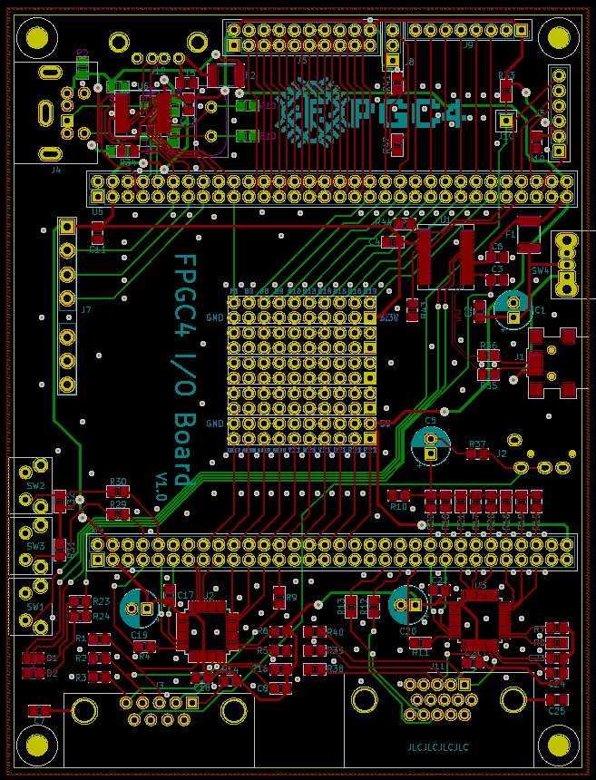
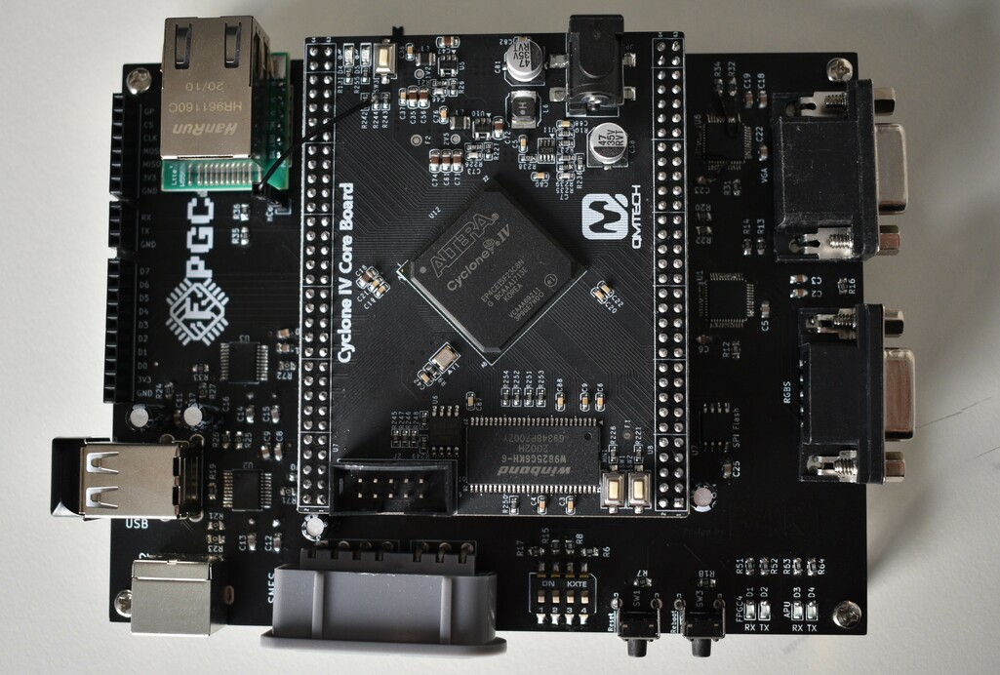
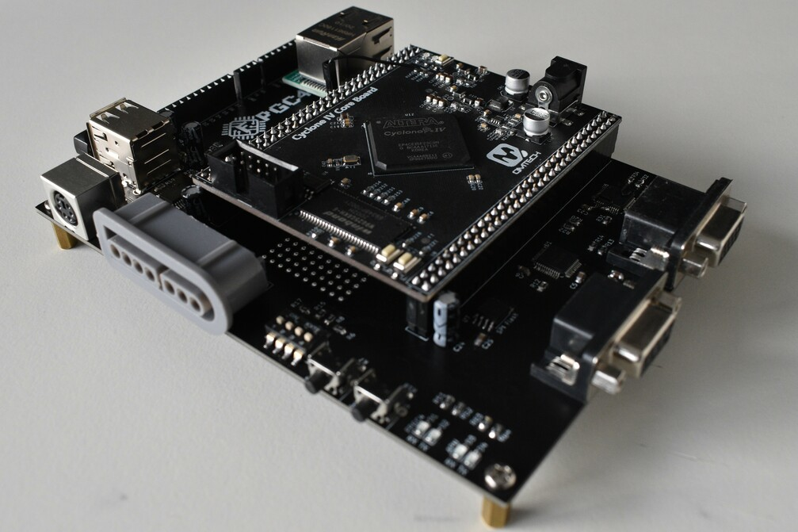
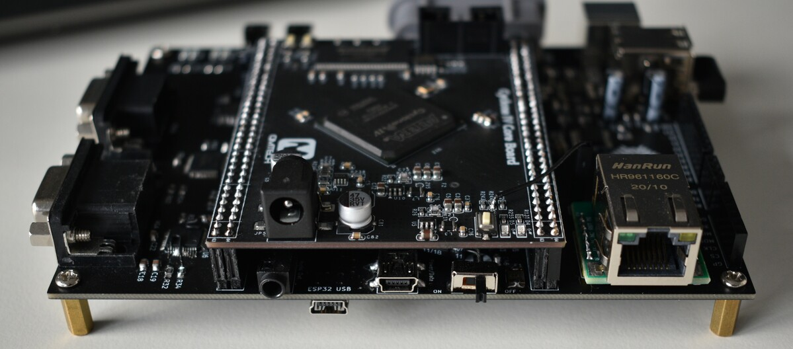
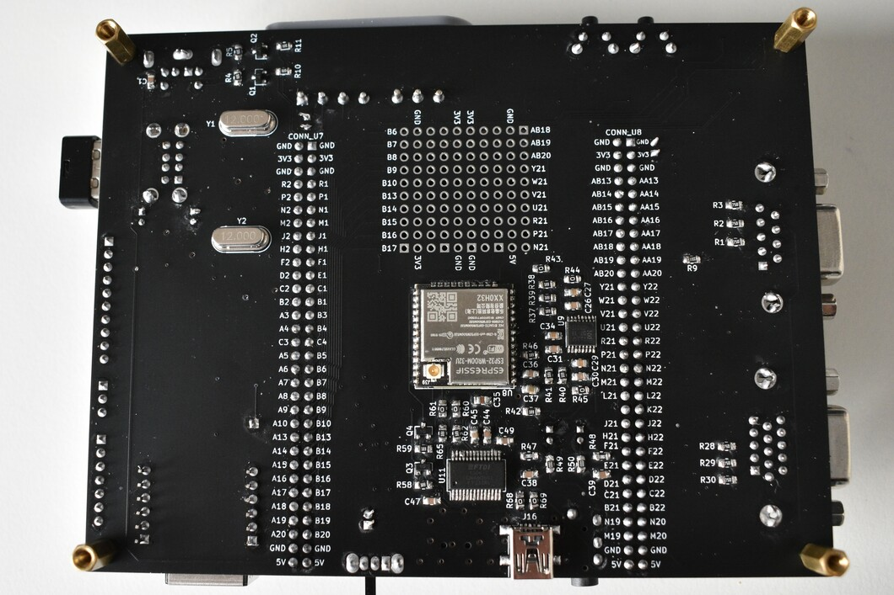
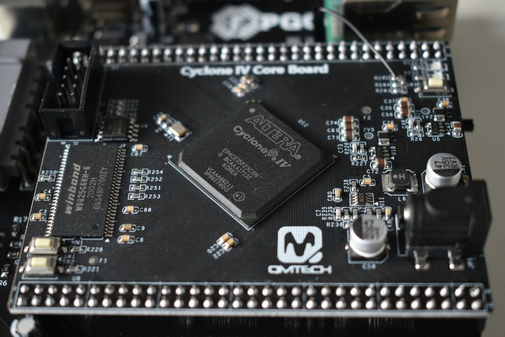

# I/O Board

!!! info "TODO"
	Rename to I/O Board, add second PCB version, add schematics etc.

I have designed an I/O wing for the FPGA development board, as a replacement for the cardboard box where I used to glue everything in. The PCB was designed using KiCad and manufactured by JLCPCB. The KiCad project files (including schematic, PCB and 3D models) are in the PCB folder.

## Design choices
During the development of the PCB, many design choices had to be made, which I will explain here.

### Layout
I wanted to keep the PCB as small as possible, for practical and aesthetic reasons. The most practical way to do this was placing the core board on top and using all four sides of the PCB for I/O. I tried to place all the I/O on a logical position, so (diagonally) video, audio and power on one side, and buttons, controllers, LEDs and headers on the other side. I placed the most used I/O on the front, which are the buttons and controllers. The nConfig button of the FPGA is also routed (using a wire from resistor R244 to J10 on the PCB) to a button on the front. The DC jack on the core board does not have to be used anymore, only the JTAG interface is needed when the FPGA design needs to be changed. Finally, I opted for a black/white design, since it matches the core board.

### Components
For the video DACs, I chose the GM713C (a clone of the ADV7123), since these are very cheap and very good (10 bits per color, can handle 1080P @60FPS without problem). Since this project only uses 8 bits for all colors, instead of 30 bits, it looks like it is a bit overkill. The alternative would be a resistor DAC, but that would put more load on the I/O of the FPGA (while terminating with 75 ohm) and does not protect the FPGA from ESD that well (I am not an expert on ESD, but using a dedicated chip seems a lot safer to me). 

As for the audio DAC, I did choose to just use some resistors and DC removing capacitor, since the audio just consists of simple square waves (no PWM). While this heavily limits the audio the FPGC5 can produce, it can still play some cool polyphonic tunes. I decided to not go for a 'real' DAC, because this project is not about audio development. The components in the audio DAC can be replaced to act as a low pass filter, which would allow PWM audio if I ever decide to do audio development on this board. Alternatively, it is also possible to add a I2S DAC (or any other DAC) on the bottom of the PCB. The audio signal is also routed to the DSUB9 (video) connector to get audio from the CRT TV without extra cables.

The entire board is powered from one mini USB port, which also is connected to an FT232RL. This way you only need one USB cable which you can plug into your PC to power the entire board and to communicate with it. I could have opted for a cheaper Chinese chip, but the FT232RL is just a really solid chip with good driver support, and does not cost that much either.

The final big component decision was the USB controller. Before having a PCB, I used the CH376S over SPI. This chip does all the complicated USB stuff and is specialized for USB mass storage. It even handles all the file system stuff. This allows me to easily add non-volatile mass storage to the FPGC5 without having to spend months on implementing all the complicated USB and file system stacks. While the documentation of the chip is pretty bad, I was still able to read other simple USB devices using this chip (with an Arduino) like a USB mouse and USB MIDI keyboard. So using this chip over something like a MAX3421E was an easy choice. The CH376S is pretty bulky, but luckily there is a smaller variant without 8-bit parallel interface that is called the CH376T. I think a CH375 or something should also work (since I do not use the SDcard controller that is added in the CH376), but I could not find that chip for sale anymore.

## Component buy list
List of the important components and where I bought them

- [MF-MSMF050-2 1812 SMB PPTC 500mA fuses](https://www.aliexpress.com/item/Free-shipping-20PCS-MF-MSMF050-2-1812-SMD-PPTC-15V-0-5A-500mA-7905-resettable-fuses/32899546296.html)
- [PS/2 Sockets](https://www.aliexpress.com/item/5pcs-PS2-socket-PS-2-socket-6P-PS-2-keyboard-mouse-holder-socket-outlet/32847566873.html)
- [0805 Capacitor kit](https://www.aliexpress.com/item/MCIGICM-0805-SMD-Capacitor-assorted-kit-36values-20pcs-720pcs-1pF-10uF-Samples-kit-electronic-diy-kit/33011427492.html)
- [0805 Resistor kit](https://www.aliexpress.com/item/33valuesX-20pcs-660pcs-0603-0805-1206-Resistor-Kit-Assorted-1R-to-1M-ohm-1-SMD-Sample/33029877427.html)
- [0805 510 + 75 Ohm resistors](https://www.aliexpress.com/item/100pcs-0805-5-1-8W-SMD-chip-resistor-0R-10M-0-1R-10R-100R-220R-330R/32865947306.html)
- [BSS138 Power Mosfets](https://www.aliexpress.com/item/100pcs-lot-BSS138-BSS138LT1G-J1-SOT23-5-Power-MOSFET/32770656298.html)
- [Tactile push buttons](https://www.aliexpress.com/item/50Pcs-DIP-6-6-7mm-Tactile-Tact-Push-Button-Micro-Switch-Momentary-Vertical-Push/32710764066.html)
- [FT232RL](https://www.aliexpress.com/item/IC-Chips-FT232RL-FT232R-FT232-USB-to-Serial-UART-28-SSOP-Original-Integrated-Circuits-for-Arduino/33021952216.html)
- [HC-49S Crystal kit](https://www.aliexpress.com/item/hc-49s-Crystal-Oscillator-electronic-Kit-resonator-ceramic-quartz-resonator-hc-49-DIP-7-kinds-X/32844442076.html)
- [0805 LED kit](https://www.aliexpress.com/item/100pcs-lot-5-Colors-SMD-0805-Led-DIY-kit-Ultra-Bright-Red-Green-Blue-Yellow-White/32888607342.html)
- [GM7123C](https://www.aliexpress.com/item/1pcs-lot-GM7123C-GM7123-LQFP-48/4000120297839.html)
- [CH376T](https://www.aliexpress.com/item/Brand-new-original-CH376-CH376T-SSOP20-quality-assurance/32955964901.html)
- [QMTECH EP4CE15 Core board](https://www.aliexpress.com/item/QMTECH-Altera-Intel-FPGA-Core-Board-Cyclone-IV-CycloneIV-EP4CE15-SDRAM-Development-Board/32949281189.html)
- [PCB](https://jlcpcb.com/)
- SNES controller connector (I already had from Aliexpress. Now there is also a black version, which I recommend over the gray version)
- USB female connectors, mini and full size (both scavenged from old hardware)
- Other things like the power switch, headers, big capacitors and audio jack (which I had already bought before)

## Cost
The PCB (or actually five of them) was made by JLCPCB for 7.44 Euro. Shipping to the Netherlands was 8.55 Euro.
The FPGA core board including shipping was about 20 Euro.
All other components (that I did not already have at home) including shipping did cost me 25 Euro.
So the entire project did cost me about 60 Euro.

## Pictures

### PCB

#### KiCad design

The PCB is designed in KiCad.

#### Manufactured

The result after sending the design to JLCPCB.

  
#### Top view

#### Front view

#### Rear view

#### Bottom view

There is a 'breadboard' on the bottom, with pins to the FPGA and power. You can also see the audio hardware of the FPGC5 (ESP32 with I2S DAC and FT232RL).

#### Core

The brain of the FPGC5: an EP4CE15 FPGA and 32MiB SDRAM.

