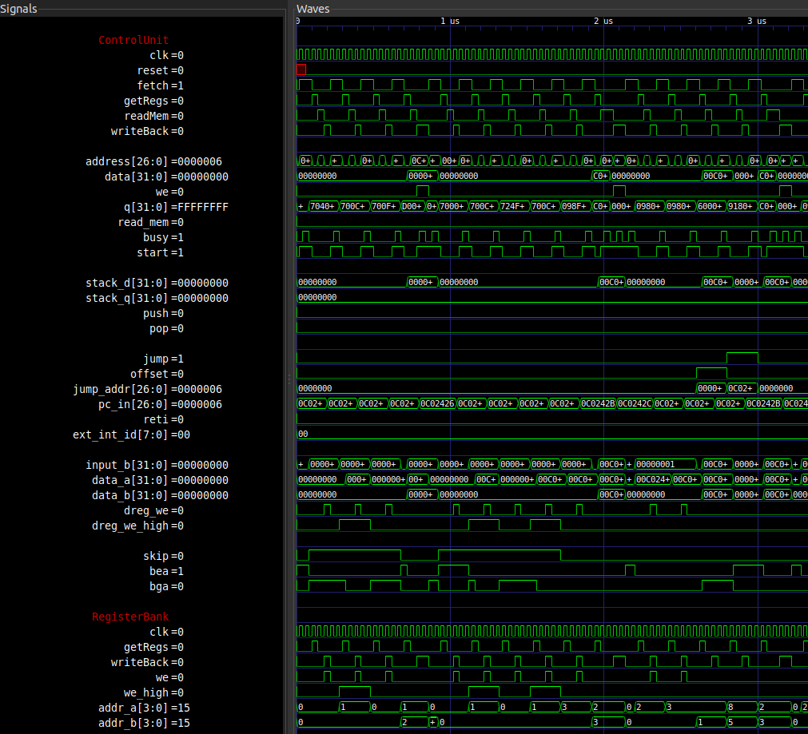

# Simulation

!!! info "TODO"
	Write this out

- using Icarus Verilog and GTKwave
- instructions how to simulate
	- add things you want to test in FPGC_tb.v
	- testbench dumps all signals to a .wave file for GTKwave
	- run the testbench with 
		iverilog -o output FPGC_tb.v && vvp output
		(you can use the verilog build script in the SublimeText3 folder if you use Sublime Text 3)
- screenshot of simulation

<figure>
    
    <figcaption>Example screenshot of simulation in GTKwave</figcaption>
</figure>